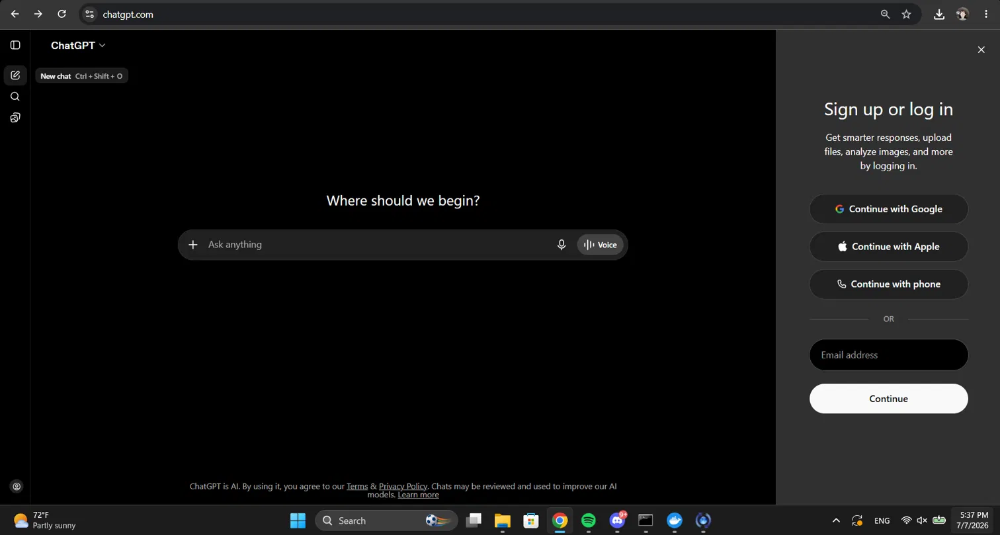
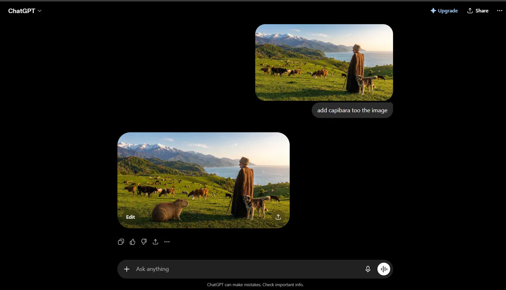
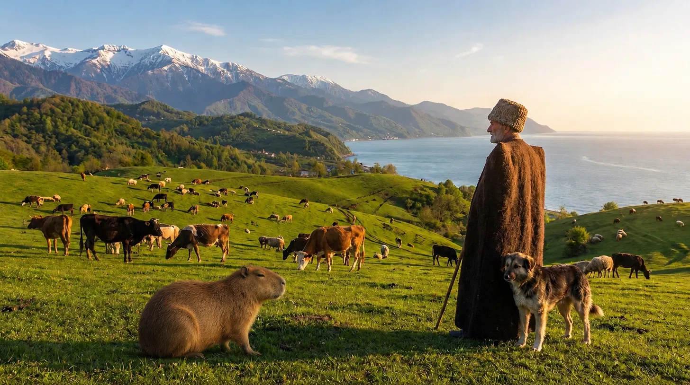
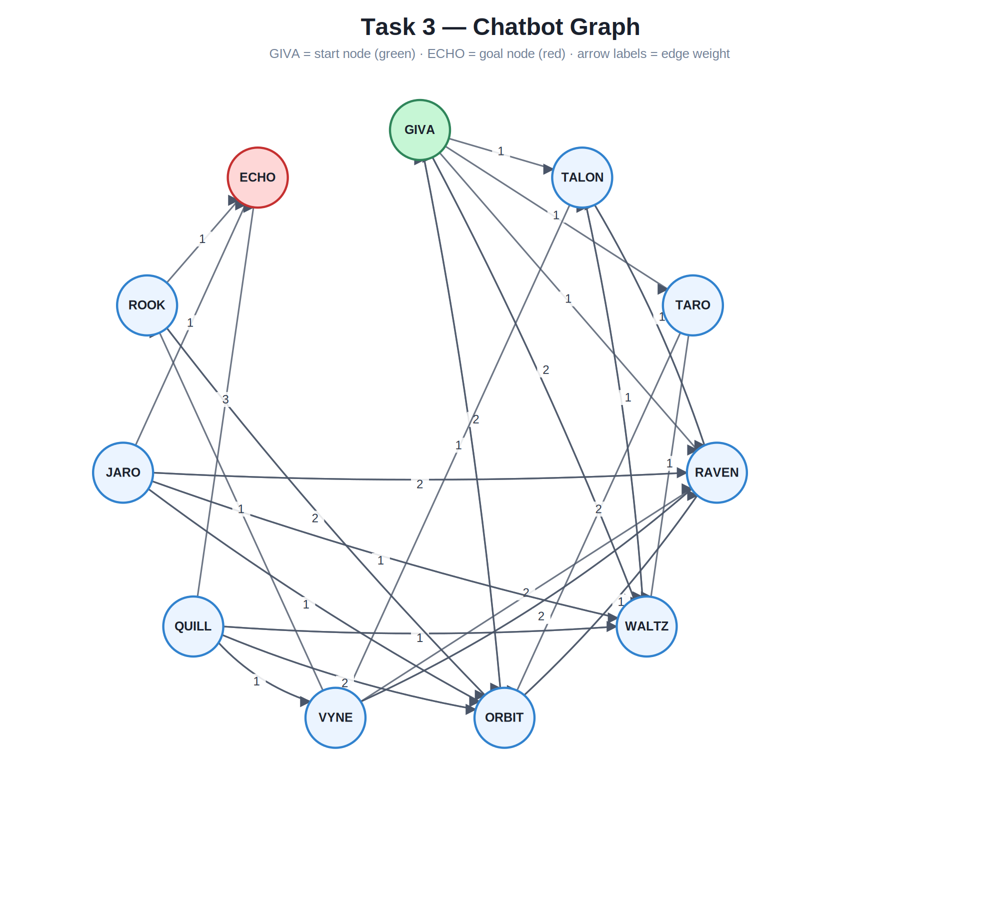

# Introduction to AI — Final Exam
### Zurab Chanturidze

## Task 1 — Adding a Capybara

I used ChatGPT to add a capybara to the provided picture.

## Task 2 — User Manual: Adding a Capybara with ChatGPT

This manual explains how to sign up for ChatGPT and use it to add a capybara to an image.

### Step 1: Sign up / Log in to ChatGPT

1. Go to [https://chatgpt.com](https://chatgpt.com).
2. On the welcome screen, click **Sign up** (or **Log in** if you already have an account).
3. Choose a sign-up method: **Continue with Google**, **Continue with Apple**, **Continue with phone**, or enter your **email address** and click **Continue**.
4. Follow the on-screen instructions to verify your account and finish signing in.

### Step 2: Upload the original picture

1. Download the source image from `https://max.ge/ai2026/final/picture-template.jpeg`.
2. In the ChatGPT chat box, click the **+** icon to attach a file.
3. Select the downloaded image and upload it into the chat.

### Step 3: Ask ChatGPT to add a capybara

1. With the image attached, type a prompt asking ChatGPT to add a capybara to the picture, for example:
   > add capybara to the image
2. Press **Enter** or click the send button.
3. ChatGPT will process the request and generate an edited version of the image directly in the chat.

### Step 4: Save the final result

1. Once ChatGPT generates the new image, hover over it and click the **download/upload** icon (or right-click → **Save image as**) to save it to your computer.
2. This is your final image with the capybara added.

### Result

**Original picture:**

## Task 3 — Chatbot Graph

**Final picture with capybara:**

